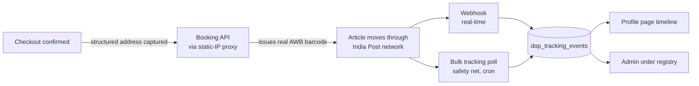

# India Post (DOP) Integration — Engineering Plan

**Status:** Planning. Blocked on a static outbound IP before any sandbox testing can start.
**Prepared for:** STAGBEETLE Engineering
**Source:** `Customer_Integrations_approach_document_UAT-7.docx`, DOP CEPT, updated 30.07.2026 — including two embedded event-code spreadsheets and a barcode-logic attachment not visible in a plain read of the docx.

> There is no real courier tracking in the app today — `shipping_carrier`/`tracking_number` is a hardcoded `'Delhivery'` label with a random fake number, set at checkout and never touched again. This is a from-scratch integration, not a provider swap.

## The one blocker

DOP's `POST /access/login` token endpoint is IP-whitelisted, and every other API needs that bearer token first — so this one thing gates the entire sandbox checklist, not just booking.

We're on Vercel, which doesn't call out from a fixed IP by default — outbound traffic comes from a shared, rotating pool. A domain and a Vercel account only control *inbound* traffic (how people reach us); they say nothing about what IP our own outbound calls leave from. See "Static IP options" below.

## Where we are vs. where this gets us

| Today | After this integration |
|---|---|
| `shipping_carrier` hardcoded to `'Delhivery'` at checkout | Real DOP barcode (AWB) issued at booking, tied to the order |
| `tracking_number` is `'DKV' + random digits` — resolves nowhere | Live multi-event timeline from India Post itself |
| Shipping status is 4 fixed stages an admin sets by hand | Admin sees the same event feed, no manual status flips |
| No tariff, no real dispatch event ever reaches the app | Optional: real Speed Post/Business Parcel tariff at checkout |

## Architecture

Same dual-path resilience pattern as the Galla sync: push first (webhook), cron reconciles anything the push missed (bulk poll), same reasoning as the retry-and-log pattern in `src/lib/galla.ts`.

## Static IP options

We can't hand DOP an IP without provisioning something first — none of these can be finished without you, since each needs either billing/account access on our Vercel team or a new cloud account.

| Option | Cost | Setup | Notes |
|---|---|---|---|
| **Vercel Static IPs** | $100/mo per project + regional data transfer | Self-serve: Project → Settings → Networking → enable Static IPs | Requires **Pro plan or higher** on this project. No code changes — all outbound traffic from the project's functions (and builds, if toggled) automatically routes through the fixed IP pair. Purpose-built for exactly this ("Auth0, PayPal, Stripe, internal corporate APIs" is Vercel's own example list). |
| **Small relay VM** | ~$5–6/mo (Lightsail, a DigitalOcean droplet, Hetzner, etc.) | Provision a box with a fixed public IP; deploy a small relay app on it (see below) | We build and own the relay code. Same box can carry into production. More moving parts, but no Vercel plan change and cheapest ongoing cost. |
| **Third-party static-IP proxy** (QuotaGuard, Fixie, etc.) | Similar to a VM, sometimes more | Sign up, get a SOCKS/HTTPS proxy URL, wire `undici`'s `ProxyAgent` into our `fetch` calls | Turnkey, but another third-party dependency and generally pricier than self-hosting for our traffic volume. |
| **Vercel Secure Compute** | Custom, Enterprise-only | Needs a Vercel sales conversation | Overkill here — its extra features (VPC peering, full network isolation) aren't needed just for IP allowlisting. Vercel's own docs point Static IPs users away from this. |

### Configuring Vercel Static IPs (if that's the pick)

1. Confirm the project is on **Pro plan or higher** — Static IPs isn't available on Hobby.
2. Vercel Dashboard → this project → **Settings → Networking → Static IPs** → enable.
3. Vercel provisions a fixed IP pair for the project; note both addresses (DOP may want both, since traffic can egress from either).
4. No application code changes — every outbound `fetch()` from our Vercel functions (including the DOP login call) starts leaving from those IPs automatically.
5. Send both IPs to `integrations.cept@indiapost.gov.in` for whitelisting.
6. Optional: toggle **"Use Static IPs for builds"** only if we ever call DOP at build time (we won't — this is all runtime).

### Configuring a relay VM (if that's the pick instead)

1. Provision a small always-on VM with a static public IP (Lightsail/DigitalOcean/Hetzner all work; pick whichever we already have an account with).
2. Deploy a minimal relay app on it — not a generic proxy, a small allowlisted forwarder with one route per DOP endpoint we actually use (`/relay/login`, `/relay/tariff`, `/relay/book`, `/relay/track`), each just forwarding the request to `test.cept.gov.in` and returning the response. Keeps the VM from becoming an open relay to anywhere.
3. Put a shared secret header on the relay itself (e.g. `X-Relay-Key`), checked before it forwards anything — otherwise anyone who finds the VM's IP can use it as a free proxy to DOP.
4. In our app, `DOP_API_BASE_URL` (env var) points at the relay instead of `test.cept.gov.in` directly; `src/lib/indiaPost.ts` (once built) doesn't need to know the difference.
5. Send the VM's static IP to India Post for whitelisting.
6. This same box carries into production later — just add the production DOP credentials as separate env vars on it, or run two relay instances.

**Whichever path we pick, the same next step follows:** get the IP(s), email them to `integrations.cept@indiapost.gov.in`, then Phase 1 (auth) can actually be tested live instead of just built against the documented contract.

## Data model changes

### `orders` — new columns

| Column | Why |
|---|---|
| `shipping_address_line1/2`, `shipping_city`, `shipping_state`, `shipping_pincode` | Booking needs structured fields; today's `shipping_address` is one flattened string built at checkout and can't be split back apart reliably |
| `dop_barcode` | The real 13-char AWB (e.g. `ET21433015XIN`), replaces the fake `DKV…` number |
| `dop_article_type` | `SP` / `BP` / `24_SPEEDPOST_DOC` / etc. — needed on every later tracking/tariff call |
| `dop_booking_ref` | `mail_booking_dom_id` from the booking response — our idempotency/reconciliation key |

### `dop_tracking_events` — new table (order owner can read their own, admin reads all)

| Column | Source |
|---|---|
| `article_number` | Links back to `orders.dop_barcode` |
| `event_code`, `event_description` | Webhook payload / bulk tracking response — see event lifecycle below |
| `office_name`, `event_datetime` | Webhook payload |
| `raw_payload` (jsonb) | Full event, kept for debugging — same reasoning as `inventory_sync_log.payload` |
| `source` | `'webhook'` or `'bulk_poll'` — which path delivered it, for when both fire for the same event |

### `dop_auth_token` — single-row cache (`app_settings`-style)

Token is valid 15 minutes. Refetching per request works but is wasteful and adds latency to every DOP call — cache `access_token` + `expires_at`, refresh only when within ~60s of expiry.

## Event lifecycle (from the embedded attachments)

These weren't in the visible text of the docx — they were embedded spreadsheets. Two related but distinct vocabularies: the **webhook** sends short codes, the **bulk tracking API** sends already-readable labels.

Pickup Requested (`Unassigned`) → Pickup Assigned (`Assigned`) → Picked Up (`Pickedup`) → Inducted (`Inducted`) → Booked (`ITEM_BOOK`) → Dispatched (`BAG_DISPATCH`) → Received at transit/destination (`BAG_OPEN`) → Invoiced to postman (`ITEM_INVOICE`) → **Delivered (`ITEM_DELIVERY`)**

Off-path branches worth handling explicitly: `ITEM_ONHOLD` (kept on hold per addressee instruction), `ITEM_REDIRECT`, `ITEM_RETURN`/RTS, and `Cancelled` at the pickup stage.

## Barcode generation (also an embedded attachment)

For sandbox we use the literal range India Post gave us. For production, we generate our own barcodes from an assigned block using the UPU S10 standard.

| Positions | Meaning | Sandbox value |
|---|---|---|
| 1–2 | Service prefix | `ET` |
| 3–10 | Serial number, our assigned block | `21433001`–`21434000` |
| 11 | Check digit — weighted modulus 11 (weights `8 6 4 2 3 5 9 7`) over positions 3–10, computed by us | computed |
| 12–13 | Origin country code | `IN` |

Check digit algorithm: multiply each of the 8 serial digits by its weight, sum, divide by 11. Remainder 0 → check digit 5. Remainder 1 → check digit 0. Otherwise, check digit = 11 − remainder (11 → 5, per the doc's own note).

## Phased build plan

Numbered because the order is real — each phase needs the one before it working. Same file-per-integration pattern as Galla (`src/lib/galla.ts`) and WhatsApp (`src/lib/whatsapp.ts`).

0. **Unblock sandbox access** — provision the chosen static-IP path, send DOP the IP(s), confirm `POST /access/login` returns a token from our infrastructure. *Blocked on us.*
1. **Auth & token lifecycle** — `src/lib/indiaPost.ts`, `dop_auth_token` table. Login, cache, auto-refresh before the 15-minute window closes.
2. **Pincode & tariff** — `pincode-search` to resolve office IDs (needed for booking); Speed Post + Business Parcel tariff to optionally show a real shipping cost at checkout instead of "Complimentary" for every order.
3. **Booking** — `checkout/page.tsx` `finalizeOrder`, UPU S10 barcode function, structured address fields. On order confirmation, call `/process-articles/:customId` with our own generated barcode; store the real AWB and article type instead of `'DKV' + random()`.
4. **Tracking** — `/api/dop/webhook`, `/api/dop/poll` (cron), `dop_tracking_events`. Real-time webhook receiver + a cron hitting `/tracking/bulk` (up to 500 articles/call) for any order whose latest event is stale.
5. **Admin visibility** — `/admin/india-post`, an `/admin/integration`-style status page, plus the real event feed in the order registry instead of the manual carrier/status dropdown.
6. **Customer-facing timeline** — `profile/page.tsx`. Replace the 4-stage progress bar with the real event list when `shipping_carrier === 'India Post'`; falls back to today's bar for any order on another carrier.
7. **Go-live** — matches DOP's own checklist: whitelisted production IP, final API credentials, signed-off test results, escalation matrix on file.

## Sandbox test matrix

| Their checklist item | Our concrete test | Status |
|---|---|---|
| Token generation working | Login with sandbox creds, confirm token + 15-min expiry handling | Blocked on IP |
| Tariff calculation validated | Run all 5 tariff endpoints against the doc's sample inputs, diff against documented sample outputs | Queued |
| Booking API tested | Use the 5 given contract_id/article_type pairs, one real booking each, confirm barcode + tariff in response | Queued |
| Event download verified | Confirm webhook receiver gets a real event after a sandbox booking | Queued |
| Tracking API validated | `/tracking/bulk` against our own sandbox-booked barcodes, not just the doc's sample AWBs | Queued |
| SFTP upload tested | Not planned — API integration covers our volume; revisit if bulk file upload becomes worthwhile | Deferred |

## Sandbox credentials & test IDs on file

| Login | Value |
|---|---|
| username | `9999999999` |
| password | `Dop@1234` |
| bulk_customer_id | `3000064781` |

| article_type | contract_id |
|---|---|
| `SP` | `41585456` |
| `BP` | `41367422` |
| `24_SPEEDPOST_DOC` | `41469430` |
| `24_SPP_PARSPL` | `41918281` |
| `48_SPEEDPOST_DOC` | `41471113` |

Test AWB series: `ET21433001XIN` to `ET21434000XIN`.

## Questions worth sending back to integrations.cept@indiapost.gov.in

1. How is the webhook receiver actually registered on your side — do we submit a URL somewhere, and is there a signing scheme (like our own `X-Stagbeetle-Signature` for Galla) so we can verify a callback genuinely came from India Post?
2. What prefix + serial block + country code do we get assigned for production barcode generation, per the UPU S10 logic in your attachment?
3. Our source office is Bengaluru — is there a specific `source-office-id` / `pickup_dropoff_office_id` we should standardize on for all bookings, or does that vary per shipment?
4. On a booking error for one article in a batch (like the sample "Dropoff pincode must be exactly 6 digits" response), is there a way to resubmit just that article without re-sending the whole batch?
5. Confirming the static IP is genuinely a one-time whitelist for both the login API and the webhook relationship — not something we need to resubmit per environment (sandbox vs. production).
