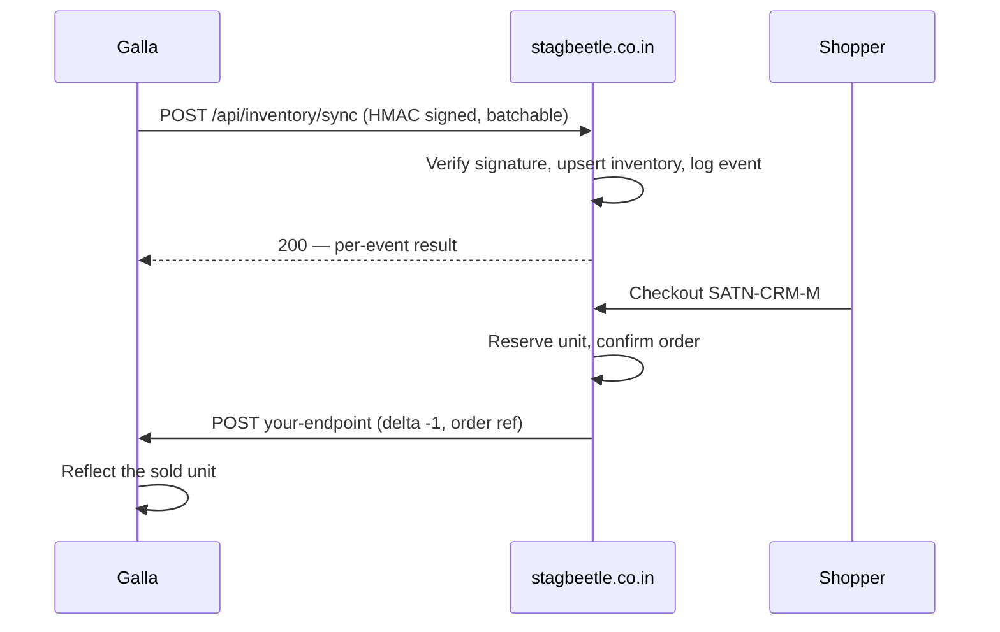

# Inventory Sync — Integration Guide for Galla

**Status:** Inbound API live and tested. Outbound leg pending Galla's input.
**Prepared for:** Galla integration team
**Owner:** STAGBEETLE Engineering

> This is the live, working API on our side — every request/response shape below has been tested against real data, not proposed. The one open item is Galla's endpoint for us to call after an online sale; see "What we need from you."
>
> Formatted version for sharing: https://claude.ai/code/artifact/640bf54a-967b-410e-97d0-7777816bebf5

## SKU convention

Every stock event needs to reference one of our SKUs. Each SKU is **Style + Colour + Size**, hyphen-joined and uppercased — generated automatically when a garment is added to the catalog, not typed by hand:

```
STYLE-COLOUR-SIZE

// e.g. a Satin Shirt, Cream colourway, size Medium:
SATN-CRM-M
```

This is the exact value to send as `sku` in every sync event below. If Galla's system tracks stock at a coarser level (e.g. only down to colour, not size), see question 3 in "What we need from you" — that would block a clean mapping.

## How stock is modeled on our side

> **Important:** we currently track one aggregate quantity per SKU — not a per-store breakdown. When sending `quantity_on_hand` for a SKU, send the **total sellable count** (however that's defined across locations), not a single store's count. A `location_code` field is accepted and logged for future use, but it doesn't split inventory today.

Two tables back this: `product_variants` (one row per SKU, e.g. `SATN-CRM-M`) and `inventory` (on-hand count, reserved count, last sync time, which system last touched it). A SKU with no row at all is treated as available, so a product never breaks just because it hasn't been synced yet.

## Sync flow



## API to build against (live in production)

### `POST /api/inventory/sync`

Send one or many events per call (batches up to 500). Each event needs an `external_event_id` — a stable ID that makes it safe to retry the exact same call twice.

**Request**
```
POST /api/inventory/sync
Content-Type: application/json
X-Stagbeetle-Signature: sha256=<hmac>

{
  "events": [
    {
      "external_event_id": "pos-evt-88213",
      "sku": "SATN-CRM-M",
      "quantity_on_hand": 12,
      "occurred_at": "2026-08-02T10:15:00Z",
      "location_code": "store_hegde_nagar"
    }
  ]
}
```

**Response — 200**
```json
{
  "dry_run": false,
  "results": [
    { "external_event_id": "pos-evt-88213", "status": "applied" }
  ]
}
```
Other per-event statuses: `skipped_duplicate`, `skipped_stale`, `sku_not_found`.

**Event fields**

| Field | Type | Notes |
|---|---|---|
| `external_event_id` | string | Required. Your idempotency key — replaying it is a safe no-op |
| `sku` | string | Required. Must match a SKU we already have |
| `quantity_on_hand` | integer | Required. Total sellable count for this SKU, not a delta |
| `occurred_at` | string (ISO 8601) | Required. Used to reject out-of-order deliveries |
| `location_code` | string | Optional. Accepted and logged, not yet used to split stock |

**Ordering:** if `occurred_at` is older than what we already hold for that SKU, the event is recorded as `skipped_stale` and ignored — not overwritten. Events can arrive out of order without corrupting our count; the newest timestamp always wins.

### Dry-run mode

Add `"dry_run": true` at the top level of the request body to validate a batch — unknown SKUs, stale timestamps, duplicates — without writing anything. Nothing changes in our database and nothing is added to our audit log. Use this while building the integration.

### `GET /api/inventory/health`

Same signature scheme, but signed over an **empty body**. Returns `{ "ok": true, "time": "…" }` on success, `401` on a bad signature.

## Quick start / test sequence

1. **Call the health check.** Sign an empty body, confirm `{"ok": true}` comes back. A 401 here means the signature computation is the first thing to check.
2. **Send one event with `dry_run: true`.** Use a real SKU from our catalog. Confirm `"status": "applied"` and that nothing changed on our side.
3. **Send the same dry-run event again.** Confirm `"skipped_duplicate"` — proves the idempotency check works end to end.
4. **Send one real event (no dry_run).** Pick a low-stakes test SKU. Confirm the count actually updates.
5. **Send a batch.** A handful of events in one call, to confirm batching works before pointing us at the full catalog.

## What we need from Galla

This is the other direction — us calling Galla after an online sale — and it's the one piece we can't finish without their input.

1. **The endpoint URL.** Where do we POST a stock adjustment after an online order? A staging/sandbox URL first, if available.
2. **Auth mechanism.** API key in a header, HMAC signing like ours, OAuth — whatever they issue per-integration.
3. **How they identify a SKU.** Do they already track style-colour-size the way we do, or only down to colour? If coarser than ours, we need to know before this maps cleanly.
4. **Delta or absolute?** We'd send a relative adjustment (e.g. `-1`) — confirm that's wanted, not us sending the new total.
5. **Their expected payload field names.** Ours are a proposal (`sku`, `delta`, `reason`, `reference`, `occurred_at`) — happy to match their existing schema instead.
6. **Do they dedupe on their end?** We retry a failed call up to 3 times. If a retry reaches them twice, does their system avoid double-deducting?
7. **Sandbox environment?** So we can verify real responses before this touches live store inventory.

Once we have these, only one file changes on our side (`src/lib/galla.ts`) — nothing in checkout needs to change.

## Auth & security

- **HMAC-SHA256** over the raw request body, header `X-Stagbeetle-Signature: sha256=<hex>`. The same scheme already used to verify our payment provider's webhooks.
- For `GET /api/inventory/health`, sign an **empty string** (there's no body to sign).
- The shared secret is **not included in this document** — it'll be sent over a separate secure channel once we confirm who on Galla's side should receive it.
- Batches are capped at 500 events per request; no rate limit beyond that yet, so please don't send on a tight timer — event-driven pushes only.
